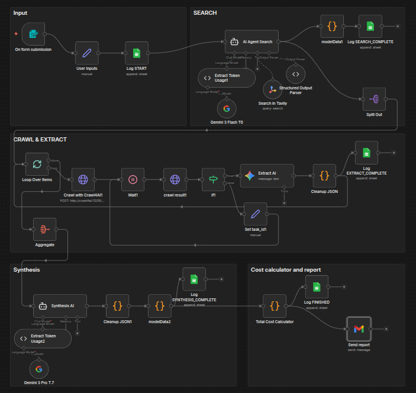

# 🔍 AI Product Researcher & Report Synthesizer

This autonomous n8n workflow performs deep market research on any product. It searches the web, extracts technical specifications from live websites, and generates a beautiful HTML report sent via email.

## 🌟 Features
* **Web Search Agent:** Uses **Tavily AI** to find the most relevant official and e-commerce product pages.
* **Deep Crawling:** Utilizes **Crawl4AI** to bypass noise and extract clean Markdown from product pages.
* **Data Synthesis:** Uses **Gemini 1.5 Pro** to resolve conflicts between sources and create a "Master Product Profile."
* **Cost Tracking:** Includes a built-in calculator that logs the exact USD cost of every run (tokens + API fees) to a Google Sheet.
* **Automated Reporting:** Sends a high-quality, mobile-responsive HTML email with images and specs.

## 🛠 Prerequisites
* **Tavily API Key:** [Get it here](https://tavily.com/).
* **Google Gemini API Key:** [Get it here](https://aistudio.google.com/).
* **Crawl4AI:** A running instance of [Crawl4AI](https://github.com/unclecode/crawl4ai).
* **Google Cloud Console:** Gmail and Google Sheets API enabled.

## 🖥️ Technical Compatibility
> [!IMPORTANT]
> **This workflow requires a Self-Hosted n8n instance.**

The cost-tracking features in this workflow rely on the **LangChain Code Node**. 
* **Self-Hosted (Docker/VPS/Desktop):** ✅ Fully supported.
* **n8n Cloud:** ❌ Not supported. 

### Why Self-Hosted?
We use custom JavaScript hooks inside the LangChain lifecycle to grab `usageMetadata`. This allows the workflow to tell you exactly how much each search and extraction cost in USD. On n8n Cloud, these advanced coding nodes are disabled for security.

## ⚙️ Setup Guide

### 1. Crawl4AI Connection
By default, the workflow looks for Crawl4AI at `http://crawl4ai:11235`. 
* If using Docker: Ensure n8n and Crawl4AI are on the same network.
* If using a remote server: Update the URL in the **HTTP Request** nodes.

### 2. Google Sheets Logging
1. Create a Google Sheet.
2. Create a tab named `LOG`.
3. Add the following headers in row 1: `Timestamp`, `Request ID`, `Product Input`, `Stage`, `Details/JSON`, `Cost (USD)`, `Tokens`.
4. Copy the Sheet ID into the **Google Sheets** nodes in the workflow.

### 3. Email Customization
Open the **Send Report** (Gmail) node. The email is written in Lithuanian by default. You can change the language of the report by modifying the `Synthesis AI` agent's system prompt or the HTML template in the Gmail node.

### 4. LangChain Code Nodes
If you are importing this into a self-hosted instance and the nodes appear as "Unknown Node," ensure you are running n8n version **1.19.4 or later**.

## 📈 Cost Management
The workflow is optimized for cost. It uses **Gemini Flash** for extraction (cheaper) and only uses **Gemini Pro** for the final synthesis (better quality). Every execution logs the cost to your Google Sheet for transparency.