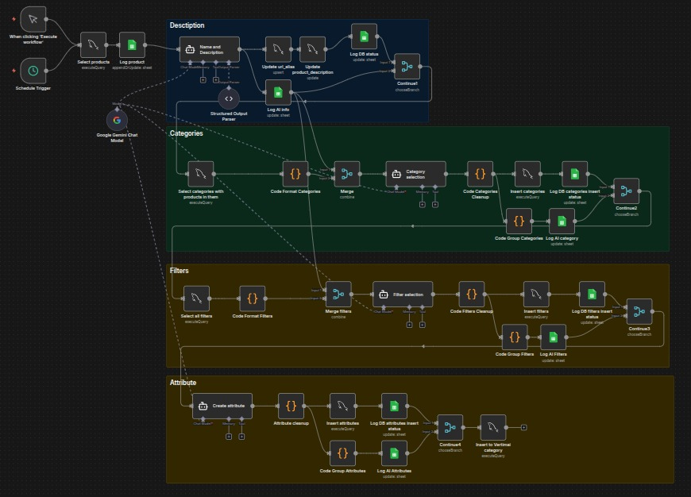
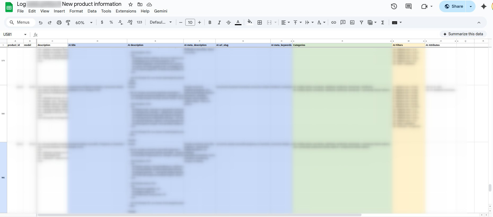

# 📦 OpenCart 1.5.6 Product AI Enrichment (Template)

This workflow is a comprehensive "AI Employee" for OpenCart store owners. It takes raw, basic product data and transforms it into a fully localized, SEO-optimized, and categorized product page.

## 🤖 What this workflow does:
1. **Product Selection:** Grabs products from your MySQL DB that are missing meta descriptions.
2. **AI Rewriting:** Uses Google Gemini to translate and rewrite titles and descriptions into a professional, SEO-friendly format.
3. **SEO Slugs:** Automatically generates URL-friendly slugs (handling special characters like š -> s).
4. **Smart Categorization:** Feeds your entire category tree to AI to pick the most specific "deepest" category for the product.
5. **Technical Filters:** Assigns filters (like Age or Material) based on the description text.
6. **Attribute Extraction:** Extracts technical data (like "Age: 3 y.") and formats it for the OpenCart attribute system.
7. **Logging:** Every step is logged to a Google Sheet so you can review the AI's work.

## 🛠 Prerequisites
* **OpenCart Database:** Direct MySQL access.
* **Google AI Studio Key:** (Free/Low cost) for the Gemini Pro model.
* **Google Sheets:** A spreadsheet to act as a "control log."

## ⚙️ Setup Guide

### 1. Database Configuration
Ensure your MySQL user has `SELECT`, `INSERT`, and `UPDATE` permissions for the following tables:
* `oc_product`, `oc_product_description`, `oc_category_description`, `oc_url_alias`, `oc_product_to_category`, `oc_filter`, `oc_product_filter`, `oc_product_attribute`.

### 2. Update Language IDs
The current SQL queries use `language_id = 2`. 
* Open the **SQL nodes** and change `language_id = 2` to your store's primary language ID.

### 3. Google Sheet Setup
Create a new Google Sheet and copy the ID from the URL. Ensure the headers match the "Setup Note" inside the workflow. Replace `YOUR_GOOGLE_SHEET_ID` in all Google Sheet nodes.

### 4. Adjust AI Prompts
Open the **"Name and Description"** Agent node. Update the `[SOURCE LANGUAGE]` and `[TARGET LANGUAGE]` in the prompt to match your needs (e.g., "From English to Lithuanian").

## ⚠️ Warning
This workflow writes directly to your database. **Always test on a staging/backup database first.** I recommend running it with the `LIMIT 1` (already set in the "Select products" node) for your first few tests.

---
*Need help customizing this for your specific OpenCart version? [Contact me for setup services!]*